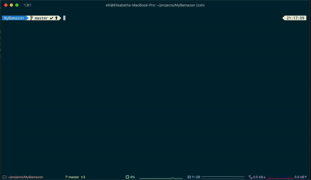
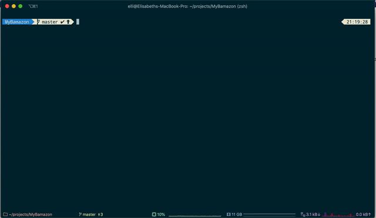

# MyBamazon

## What does it do?

An Amazon-like storefront with using MySQL and Node.js. The app will take in orders from customers and deplete stock from the store's inventory. 

## Technologies used

* MySQL
* Node.js
* Javascript

## How does it work?

### Customer view

* Prints the products in the store.
* Prompts customer which product they would like to purchase by ID number.
* Asks customer how many items they would like to purchase. If there is a sufficient amount in stock, it will complete an order for that purchase. If there is an insufficient amount of products in stock, it will notify the cutomer of insufficient inventory.
* If the purchase is successful, the quantity will be reflected in the database.



### Manager view

* This app will start with a menu asking the manager to: 

```
View products for sale
View all low inventory
Add to inventory
Add a new product to the database
```

**View Products for Sale:** list of all of the products including department and price for sale.

**View Low Inventory:** list of all the products with less than five items in stock.

**Add to Inventory:** allows the manager to select a product and add inventory.

**Add New Product:** allows the manager to add a new product to the database.




